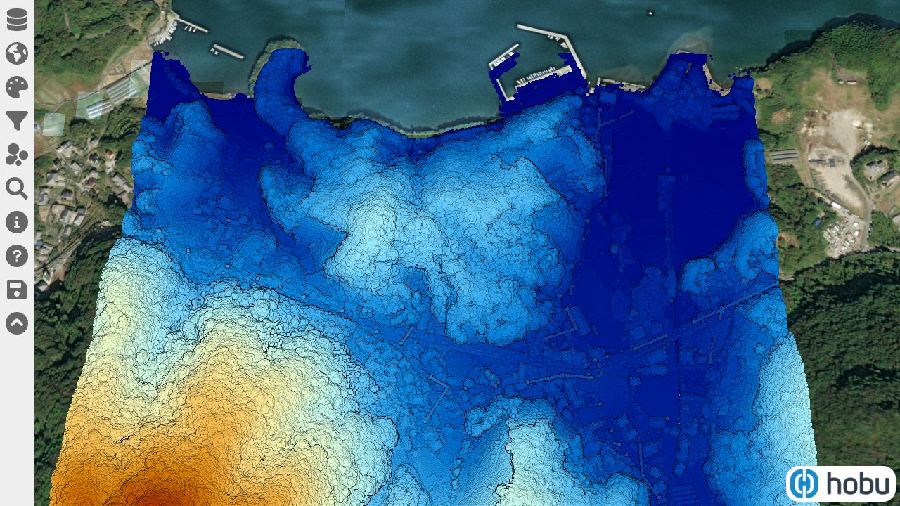
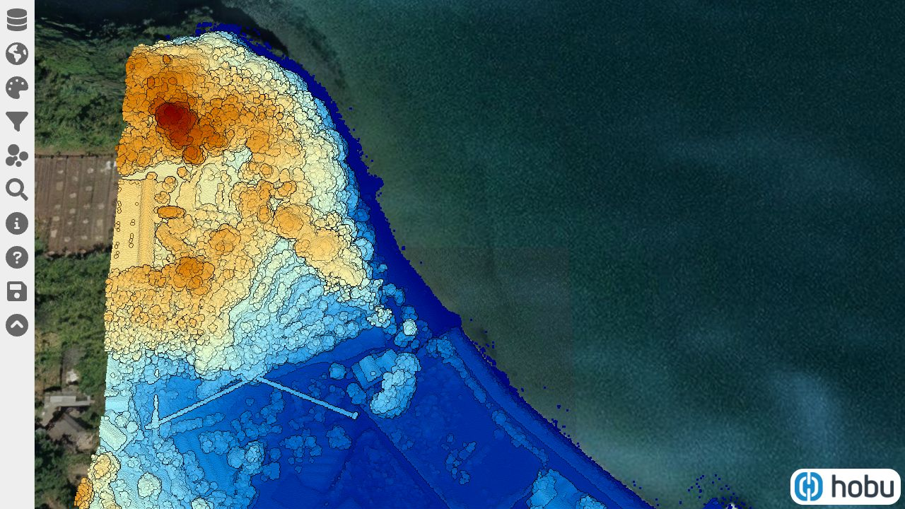

# Free Nagasaki Collection
Source: https://opennagasaki.nerc.or.jp/
## 01ke4644.copc.laz: Qma8noDqgtAg2c5SC8QrHHDpsFi8y5aHdqU7hfAMmVPtaa

## 01ke4731.copc.laz: QmRgfnwXi1v9He6Eit9ys61d9Z9ntfS7QdHMASjHH7XF8t

## 01ke4733.copc.laz: QmcMCuje7V1FEEduAiJ4d8nFgUCQfwxyJsPyvMNWXFd31Y

## 01ke4734.copc.laz: QmZrNWLCDHnbKcwqEtRwYF9mddyUNB1sTrAKBK3iXmRqSQ

## 01ke4743.copc.laz: QmYZRrBJrQ7QJSZhBGTFgsJgMR9vaDATeFaf5DdJtrQNaf

## 01ke5622.copc.laz: QmdhdNSCARAMJsAZLhFyrcjNJcNxKCNfnqCsyLNZaQShD3

## 01ke5624.copc.laz: QmQMt4H17Z1JsXcGrj5VdGmWgk12TaKmyA7xaKKEFJzPYT

## 01ke5711.copc.laz: QmXFNBrw3orTGZpQnnSKaUSd26b9wQWBwBpYRuF7cCxqfs

## 01ke5712.copc.laz: Qmd5n2oqHs5CsECYYv18hmQyZNNFQVmGUxRs3MEdBnffEm

## 01ke5713.copc.laz: QmYsShiUq9a7RqnQ5kNTbboZjPndtti9mFpQfQSNoQTEKv

## 01ke5714.copc.laz: QmTJEMHsqMW82NegJAqR5Q9HykyaKkKEBqEwfyRJbhSweh

## 01ke5721.copc.laz: QmYs5GRx3YZw8ir3FikbvZn1BGPvU4H8khwgv5yMwSCbRj

## 01ke5723.copc.laz: QmdLafwmWyccWqzR394nD9SfHMerqhonRDES5HPFqBau4m

## 01ke5724.copc.laz: QmSyXoomKDx2Qq1LX6EQjL4YGtowRZyi7swcqGqWGmnmWL

## 01ke5731.copc.laz: QmPehgLAvaw2qv8fYJ4bszxHUCK7TqVGqguc3wLEHrJFgM

## 01ke5732.copc.laz: Qmc4rKYAphk1KoeKiHWpJBT4QG7CbVCk6YMDjrxJbeS4Em

